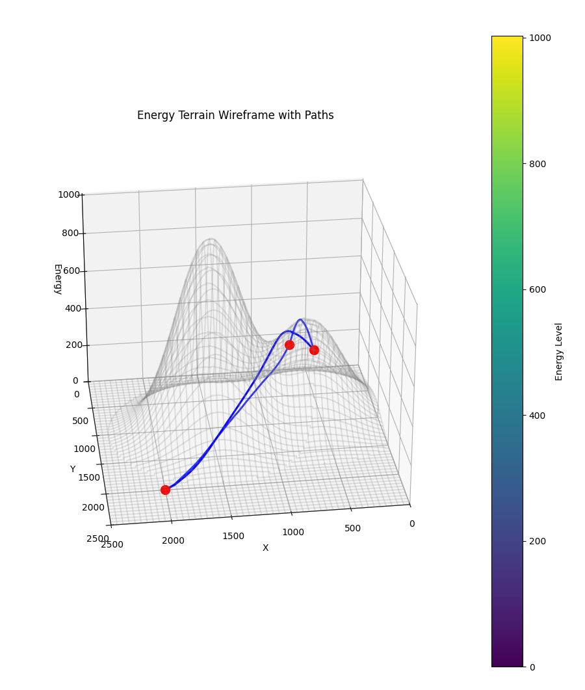
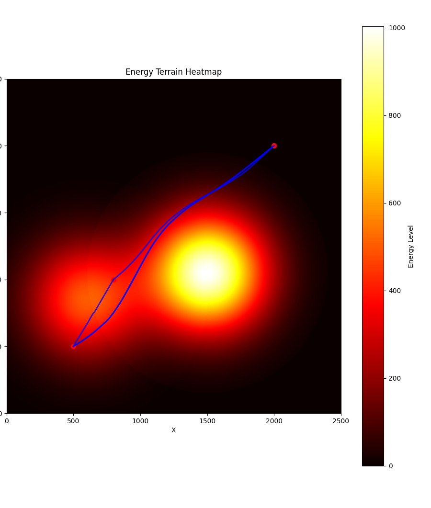
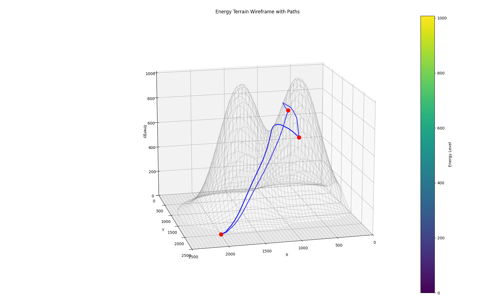
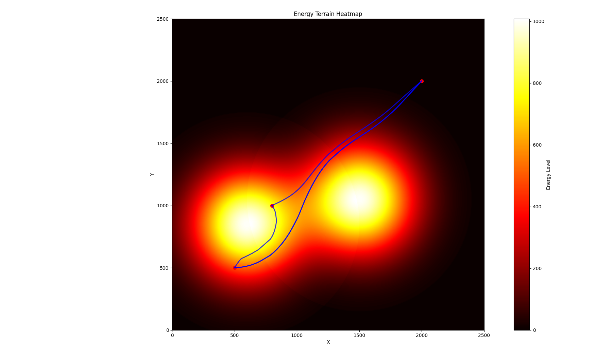

# Traffic Simulator - README
## Energy-Based Path Planning in Complex Terrain

This part implements an energy-based path planning algorithm for finding optimal routes through complex terrain. The approach uses gradient-based optimization to find paths that balance total distance with terrain characteristics. This helped us to generate road between points following a given topology, while allowing arbitrary curvatures to be included without explicitly parameterizing the curves.


*Figure 1: 3D visualization of the terrain with optimized paths (1).*


*Figure 2: Network structure overlaid on terrain heatmap (1).*



*Figure 3: 3D visualization of the terrain with optimized paths (2).*


*Figure 4: Network structure overlaid on terrain heatmap (2).*
## Mathematical Framework

### 1. Terrain Representation

The terrain is modeled as a continuous energy surface V(x,y), constructed as a sum of Gaussian functions:

V(x,y) = ∑ᵢ Vᵢ(x,y)

Each energy zone contributes:
```
Vᵢ(x,y) = hᵢ exp(-[(x-xᵢ)² + (y-yᵢ)²]/(2(rᵢ/3)²))  if d ≤ rᵢ
        = 0                                          if d > rᵢ
```
where:
- hᵢ is the height/energy of zone i
- (xᵢ,yᵢ) is the center of zone i
- rᵢ is the radius of effect
- d = √[(x-xᵢ)² + (y-yᵢ)²] is the distance from center

The factor of 3 in the denominator ensures that the Gaussian function falls to approximately 1% of its peak value at the radius boundary.

### 2. Path Optimization

A path P is represented as a sequence of n points: P = {(x₁,y₁), (x₂,y₂), ..., (xₙ,yₙ)}

The total cost function C(P) combines three components:

1. Path Length Cost:
   ```
   L(P) = ∑ᵢ₌₁ⁿ⁻¹ √[(xᵢ₊₁-xᵢ)² + (yᵢ₊₁-yᵢ)² + (V(xᵢ₊₁,yᵢ₊₁)-V(xᵢ,yᵢ))²]
   ```

2. Terrain Height Cost:
   ```
   H(P) = (1/n) ∑ᵢ₌₁ⁿ V(xᵢ,yᵢ) / max(V)
   ```

3. Gradient Cost:
   ```
   G(P) = (1/n) ∑ᵢ₌₁ⁿ ‖∇V(xᵢ,yᵢ)‖
   ```

The complete optimization objective:
```
minimize C(P) = L(P) + αH(P) + βG(P)
```
subject to boundary constraints at start and end points.

where:
- α controls terrain height avoidance
- β controls steep slope avoidance

## Implementation Details

### Core Components

1. **TerrainGenerator**: Creates and manages the energy surface
2. **GradientPathFinder**: Implements path optimization using L-BFGS-B
3. **NetworkAdapter**: Handles conversion between network structures
4. **Visualizer**: Provides 2D and 3D visualization tools

### Usage Example

```python
from sandbox import Sandbox

# Create environment
sandbox = Sandbox(2500, 2500, alpha=0.3, beta=0.2)

# Add energy zones
sandbox.create_energy_zone(750, 750, 800, 800)

# Create network
network = Network()
network.add_node(1, 500, 500)
network.add_node(2, 500, 1000)
network.add_edge(1, 1, 2)

# Add network to sandbox
sandbox.add_network(network)

# Visualize results
sandbox.visualize_energy()
sandbox.plot_heatmap()

# Save state
from serializer import SandboxSerializer
SandboxSerializer.save_sandbox(sandbox, "my_sandbox.json")
```

### Dependencies

```text
numpy>=1.24.0
scipy>=1.11.0
matplotlib>=3.7.0
networkx>=3.1
dataclasses>=0.6
typing>=3.7.4
```

### Path Finding Process

1. Initialize path as straight line between endpoints
2. Compute gradient of cost function
3. Update path using L-BFGS-B optimization
4. Repeat until convergence or max iterations reached

## Features

- Gradient-based path optimization
- Multiple energy zone support
- Network structure integration
- State serialization
- 2D and 3D visualization
- Configurable cost weights

## Extension Possibilities

1. Multi-agent path planning
2. Dynamic terrain updates
3. Real-time path adjustment
4. Alternative optimization methods
5. Additional cost components

## Limitations and Considerations

1. Local minima in optimization
2. Computational complexity with large networks
3. Parameter tuning requirements
4. Trade-offs between objectives
